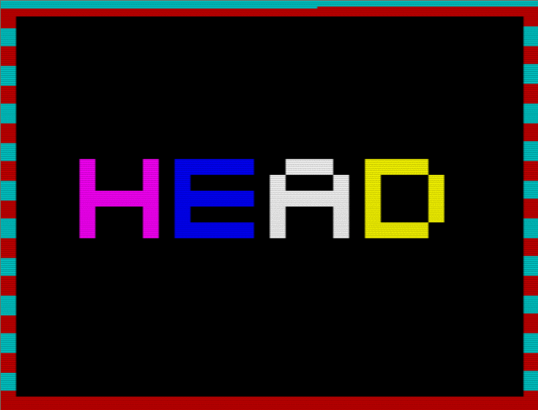

# ShitHead
Z80 source code for the Sinclair 48K ZX Spectrum game 'ShitHead'

[WOS](https://worldofspectrum.org/archive/software/games/shithead-simon-laszcz)

Released in 2007

Originally compiled using the Pasmo cross-assembler for Windows
